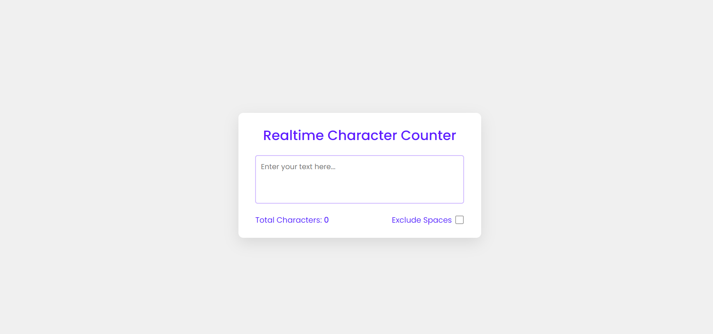
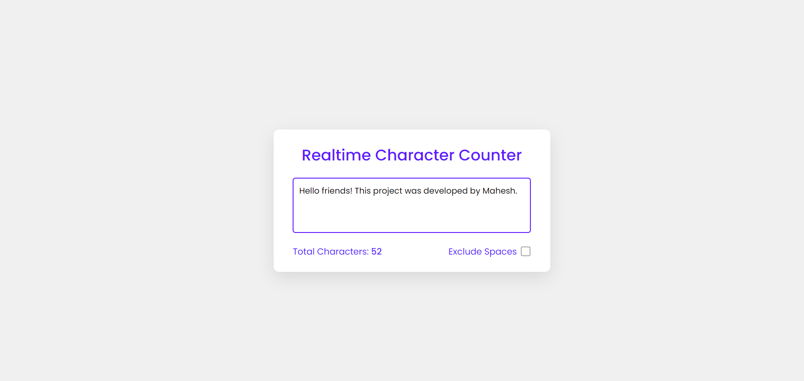

# RealTime Character Counter

A simple and interactive character counter application built with HTML, CSS, and JavaScript. This app allows users to count characters in real time.

## Visit the Website

[Visit Website](https://maheshhattimare.github.io/realtime-character-counter/)

## Features

- User-friendly interface
- Real-time character count
- Count characters without spaces

## Technologies Used

- HTML
- CSS
- JavaScript

## Screenshots

### Interface


### Result


## Installation

1. Clone the repository:
    ```bash
    git clone https://github.com/maheshhattimare/realtime-character-counter.git
    ```
2. Navigate to the project directory:
    ```bash
    cd realtime-character-counter
    ```
3. Open `index.html` in your web browser to start the application.

## Usage

1. Open the `index.html` file in your preferred web browser.
2. Enter text in the textarea.
3. Toggle the checkbox if you want to count characters without spaces.
